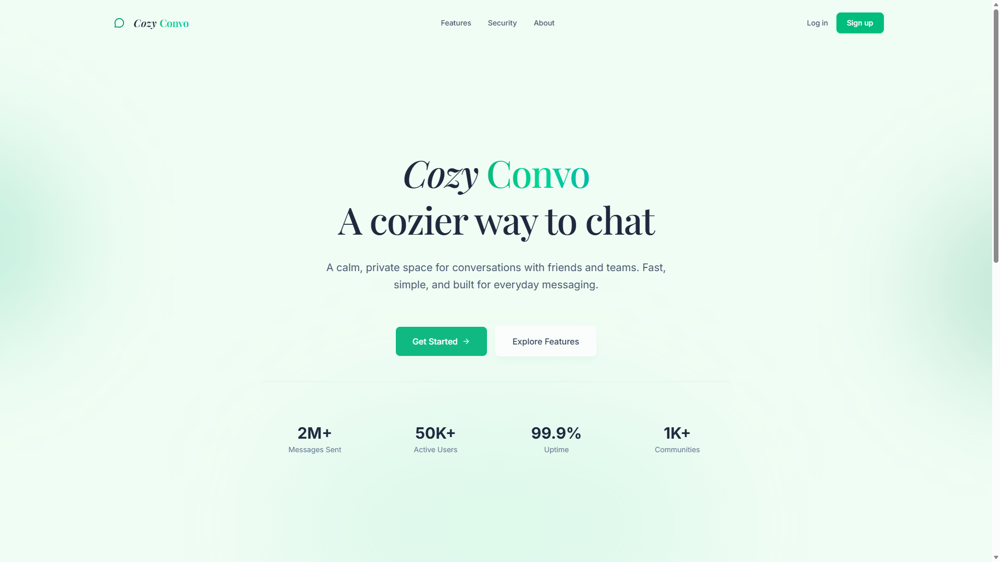

# Cozy Convo

Welcome to Cozy Convo, a full-stack chat application for cozy, private conversations.

## 🚀 Overview

Cozy Convo is built with a modern stack, combining a fast React frontend with a robust Python backend.

  

- **Frontend**: React + TypeScript + Vite
- **Backend**: Python (FastAPI/CRUD architecture)

## 📁 Project Structure

- `/frontend` - Contains the React user interface, built with Vite and TypeScript for fast development and type safety.
- `/backend` - Contains the Python API, providing the necessary endpoints to serve the frontend.

## 🛠️ Getting Started

### Prerequisites

- Node.js (for the frontend)
- Python 3.x (for the backend)

### Frontend Setup

1. Navigate to the frontend directory: `cd frontend`
2. Install dependencies (e.g., `npm install`)
3. Run the development server (e.g., `npm run dev`)

### Backend Setup

1. Navigate to the backend directory: `cd backend`
2. Install requirements
3. Start the application

## 📝 License

This project is open-source. Please see the [LICENSE](LICENSE) file for more information.
